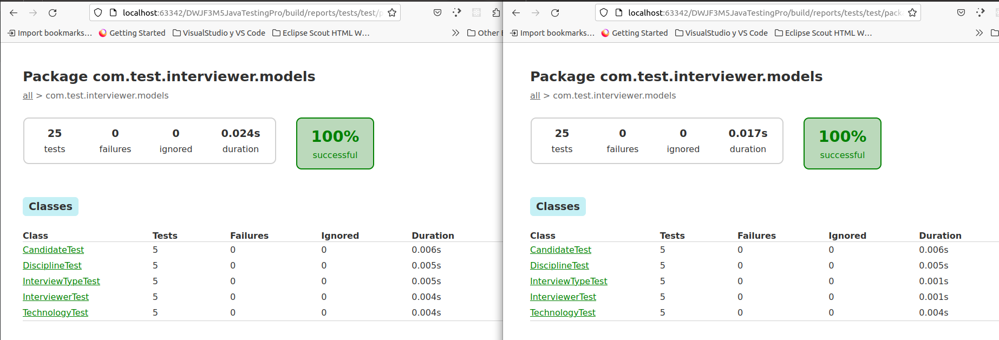

# DWJF3M5JavaTestingPro

# Postwork 3

## 🎯 OBJETIVOS

- Comparen el funcionamiento de JUnit y TestNG en escenarios similares.
- Analicen el funcionamiento de la ejecución en paralelo en JUnit 5 y en TestNG.

## 🚀 DESARROLLO

Antes de comenzar con la actividad te recomendamos revisar el siguiente recurso para que comprendas que hay detrás de la ejecución de pruebas en paralelo utilizando JUnit 5:

### Ejecución Paralela

**Sigan las siguientes instrucciones y dividan las actividades de forma equitativa entre cada miembro del equipo:*

1. En su archivo build.grade asegurense de tener junit en su versión 5.3 o superior.
2. En el mismo archivo asegurense que la configuración test luzca de la siguiente forma.

test {
useJUnitPlatform()
systemProperty 'junit.jupiter.execution.parallel.enabled', 'true'
}

3. Ejecuten las pruebas
4. Cambien la configuración anterior a false y observen las diferencias en los tiempos de ejecución

Para cerrar nuestro postwork, revisemos el siguiente video que realiza un benchmark de la ejecución en paralelo entre diferentes frameworks de pruebas:

¿Cuál tecnología es más eficiente para ejecutar los tests en paralelo?

### Reflexiones finales

¿Notaron alguna diferencia en el tiempo de ejecución de las pruebas?
- Si
- 

¿Qué ventajas consideran que aporta la ejecución en paralelo?
- Reduce los tiempos de ejecución de las pruebas

¿Creen que existe alguna desventaja de ejecutar nuestras pruebas en paralelo?
- Algunas que sean dependientes de otros procesos tomaran tiempo.

¡Mucho éxito y reta tu potencial!
