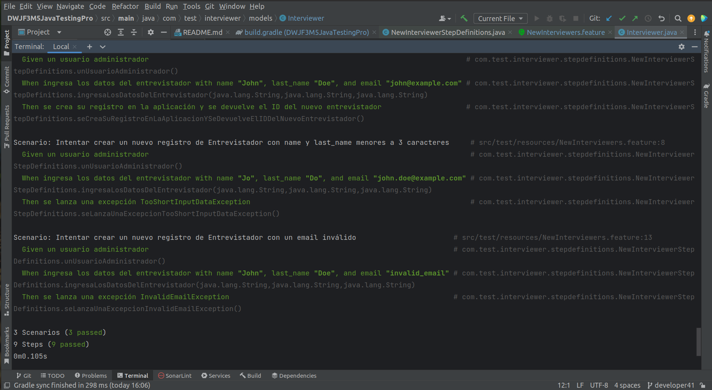

# DWJF3M5JavaTestingPro

# Postwork

Recuerda que tambien puedes consultar tu postwork en la App Bedu.

## 🎯 OBJETIVOS

- Implementen pruebas de caja negra y blanca

## 🚀 DESARROLLO

Continuaremos con el desarrollo del software de entrevistadores y exploramos las pruebas de caja negra y blanca realizando el siguiente ejercicio:
- Añadir las pruebas de casos uso generadas durante el Reto 1
- Diseñar posibles pruebas de caja blanca para el código
- Debemos generar pruebas de caja negra y blanca según corresponda

### Sigan las siguientes instrucciones y dividan las actividades de forma equitativa entre cada miembro del equipo:

1. Durante el reto 1 generen los casos de uso y sus especificaciones par acumplir con la historia de usuario: añadir entrevistadores.
2. En el archivo de pruebas añadan las pruebas correspondientes para validar que se cumplan los criterios de aceptación.
3. Modifiquen el código de alta de entrevistadores de ser necesario.
4. Repitan los pasos 2 y 3 hasta que todos los criterios de aceptación sean validados con al menos una prueba y todo tus pruebas pasen.

Deberás considerar los posibles casos "extremos" (_edge cases_), validaciones, errores y posibles excepciones.

# Reto 1 - Técnicas de caja negra: Requerimiento funcional / Caso de uso II
- 
- Historia de usuario en formato AS, WANT, SO, para añadir entrevistadores.
- Criterios de aceptación en formato GWT
- Casos de Uso

#### Historia de usuario

Añadir entrevistadores

El administrador quiere registrar nuevos entrevistadores en el sistema.

#### Historia de usuario (As, Want, So)

Añadir entrevistadores

AS un usuario administrador I WANT poder registrar nuevos entrevistadores SO los entrevistadores se pueden consultar en el sistema

#### Descripción Given, When, Then (GWT)

Criterios de aceptación

GIVEN un usuario administrador WHEN ingresa los datos del entrevistador THEN se crea su registro en la aplicación

#### Caso de Uso

Actor:

    Usuario administrador (isAdmin)

Precondiciones:

    Un usuario que cuenta con los persisos de administrador habilitados. 
    (No aplica, por el momento no se ha desarrolaldo ningun microservicio 
    de Login/SignUp que genere Tokens para validar los usuarios logueados, 
    se considera al del sistema como un usuario habilitado) 

Input:

    name (Un String de al menos 3 caracteres)
    last_name (Un String de al menos 3 caracteres)
    email (Un String de n caracteres)

Output:

    Las instancia del Entrevistador generado.

Flow:

    1. Crear el entrevistador correspondiente
        1.1 Validar el email
            1.1.1 Si el email es invalido lanzar la excepción InvalidEmail
        1.2 Crear un nuevo objeto de la clase Interviewer
        1.4 Guardarlo 
        1.5 Responder con el Id de objeto del nuevo entrevistador, porque es igual al tamaño de la lista
    2.Enviar la respuesta

-

### Indicaciones generales

Respondan las siguientes preguntas:

¿Cuál es la principal diferencia que notan entre las pruebas de caja negra y blanca?
    - En las primeras esperamos una respuesta sin saber la estructura interna de los modulos 
    y en la segundas nosotros sabemos como están construidas.

¿Qué ventajas consideran que tienen unas sobre las otras?
    - En las primeras permiten trabajar separados a los equipos de Testing y desarrollo
    al tener estos últimos solo los requerimientos de evaluación.  
    Los equipos pueden trabajar empleando metodologías ágiles.
    En las segundas el equpo de desarrollo de la mano del de Testing o solo puede ir evaluando
    y descubriendo errores antes que su costo sea considerable.
    En nuestras notas el valor puede ser mínimo durante la fase de desarrollo y multiplicarse 
    un 1,000,000 veces ya en producción; generando un riesgo para la empresa.

¿Creen que existe alguna desventaja de contar solo con pruebas de caja negra?
    - El excesos de confianza y el no cubrir todas las posibilidades puede 
    ser un error que más tarde sea mortal, hablando económicamente y legalmente para la compañía.  